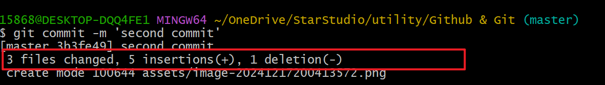

# Git

> [尚硅谷2024最新Git企业实战教程，全方位学习git与gitlab_哔哩哔哩_bilibili](https://www.bilibili.com/video/BV1NK421Y7XZ/?spm_id_from=333.1245.0.0&vd_source=b14ac361c3cb3cf90bbddfb7e831b92a)
>
> [尚硅谷Git入门到精通全套教程（涵盖GitHub\Gitee码云\GitLab）_哔哩哔哩_bilibili](https://www.bilibili.com/video/BV1vy4y1s7k6/?spm_id_from=333.337.search-card.all.click&vd_source=b14ac361c3cb3cf90bbddfb7e831b92a)
>
> > Git
>
> + Git 介绍  分布式和集中式版本控制工具
> + Git 安装
> + Git 命令 git常用指令
> + Git 分支 分支特性、分支创建、分支转换、分支合并、代码合并冲突解决
>
> > GitHub
>
> + 创建远程库
> + Push
> + Pull
> + Clone
> + SSH免密登录
> + Idea 集成 GItHub
>
> > GitLab
>
> + GitLab 服务器的搭建和部署
> + Idea 集成 GitLab

## C1 Intro

+ 官网介绍

+ 版本控制

+ 分布式版本控制（`Git`） VS 集中式版本控制（`SVN`）

  ​	集中式版本管理：文档统一保存在一个中央服务器中。

  ​	分布式版本管理：个体自我维护本地库，通过远程库来同步各自的本地库以及影响远程库的版本控制。
+ 发展历史

  ​	Linus 在开发 Linux 系统的时候，开发社区多人维护的同时，为了避免手动合并的麻烦，在使用了3年 BitKeeper后，被撤销使用权后，自己在两周用 C 开发了一个 Git 的版本管理工具。之后也上线了跟 Git 配套的 GitHub 开源平台。
+ 工作机制和代码托管中心

  ```mermaid
  flowchart BT
      subgraph local
      A[Work（Coding）]--"git add"-->B[temp（临时存储）]
      B--"git commit"-->C[local repository（历史版本）]
      end
      
      C--git push-->D[(remote repository（shared 历史版本）)]
  
  ```

## C2 Install

## C3 Commands

### 常用命令

| 命令名称                                                     | 作用           |
| ------------------------------------------------------------ | -------------- |
| git config –global user.name username                        | 设置用户签名   |
| git config –global user.email email                          | 设置用户签名   |
| <span style="color:red;">git init</span>                     | 初始化本地库   |
| <span style="color:red;">git status</span>                   | 查看本地库状态 |
| <span style="color:red;">git add filename[/.]</span>         | 添加到暂存区   |
| <span style="color:red;">git commit -m “log info” fileName</span> | 提交到本地库   |
| <span style="color:red;">git reflog</span>                   | 查看历史纪录   |
| <span style="color:red;">git reset --hard versionID</span>   | 版本穿梭       |

### 设置用户签名


​	设置一次即可，用来在 git 提交的时候判断提交用户身份。

### git init

> 初始化本地库
>
> 让本地的项目能让 git 管理到

`git init` 生成 .git 目录  git 的管理记录都存储在其中

### git status

> 查看本地库状态

`git status`

### git add

> 添加暂存区

`git add <file>`【添加到暂存区】

`git rm --cached <file>`【从暂存区移除，还存在于工作区】


### git commit

> 提交本地库

`git commit -m 'LOGINFO' filename`


### 修改文件



git **靠行维护**，修改某一行，会以删旧插新的方式维护，所以**修改一行等于 删1增1**

### git reset

> 版本穿梭

`git reset --hard versionID`


**head 指针 对分支和版本之间的切换原理**


## C4 Branch Op

### branch


### 查看创建切换

| cmd                   | inf                        |
| --------------------- | -------------------------- |
| `git branch 分支名`   | 创建分支                   |
| `git branch -v`       | 查看分支                   |
| `git checkout 分支名` | 切换分支                   |
| `git merge 分支名`    | 把指定分支合并到当前分支上 |

在 `master` 的基础上新增 `hot-fix` 分支，开发后测试正常合并回 `master` 分支


### conflict merging

> + 前面的合并是在主分支引出新增分支后，增删修改，然后合并回主分支，没有任何的冲突
> + 假如`hotfix`在开发的同时，`master`合并了别的分支的代码，主分支有了修改，再合并就会出现冲突

## C5 Team Corporation

## C6 GitHub

## C7 IDEA Git

## C8 IDEA GitHub

## C9 Gitee

## C10 GitLab

